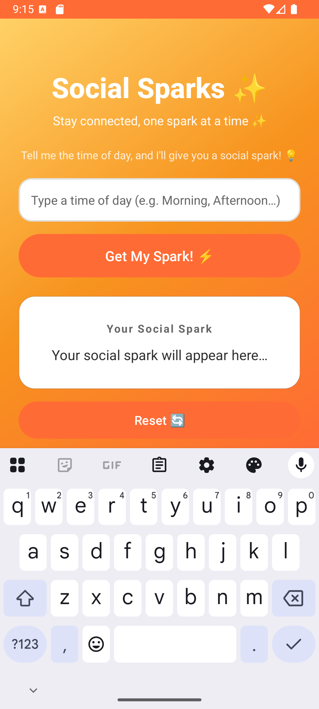
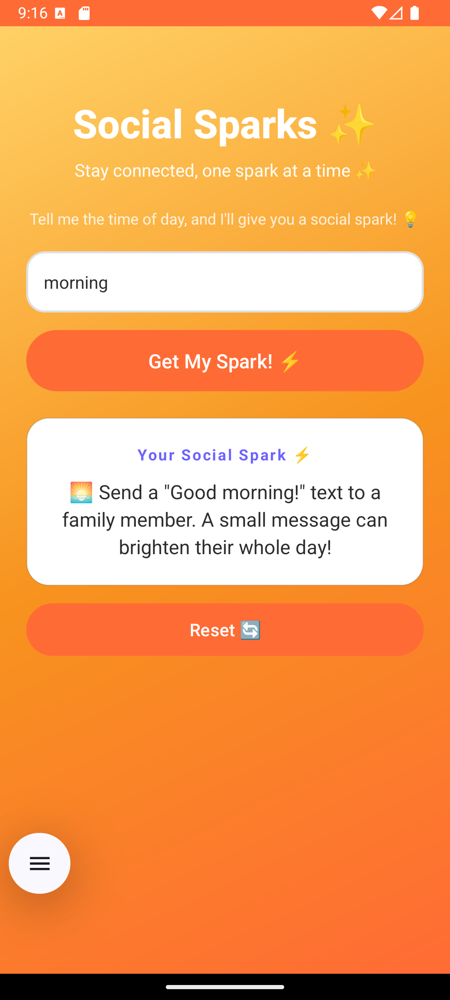
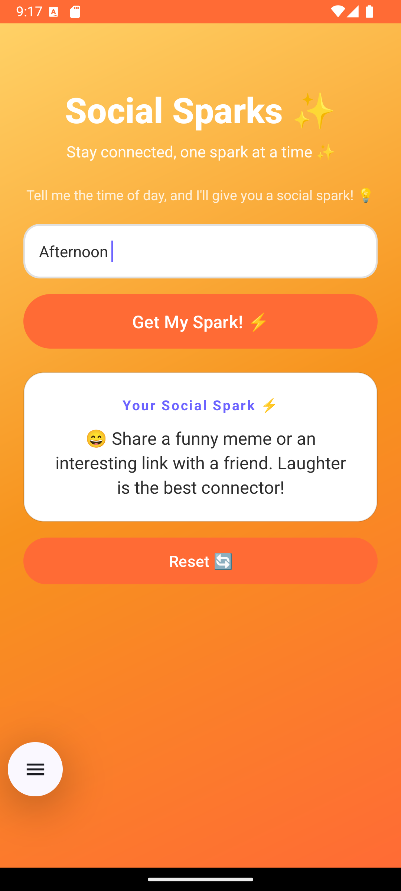
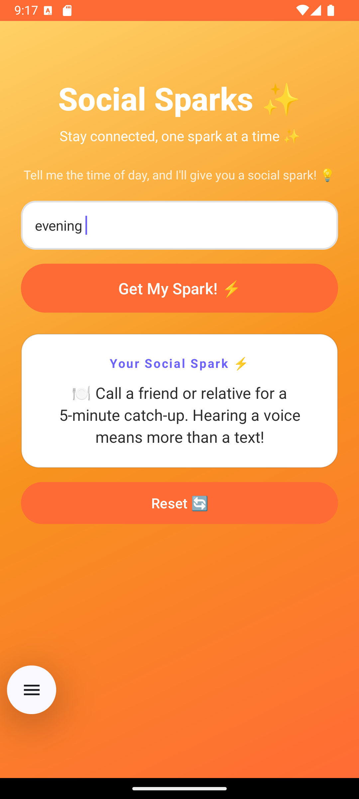
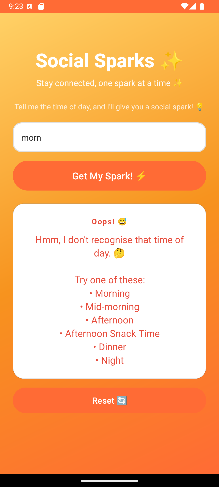
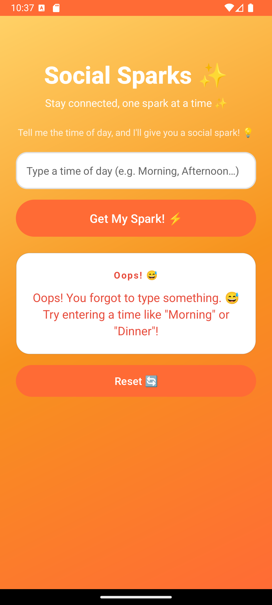

Social Sparks 

# Table of Contents

- [Purpose of the App](#-purpose-of-the-app)
- [App Design & Considerations](#-app-design--considerations)
- [How It Works](#-how-it-works)
- [Screenshots](#-screenshots)
- [Project Structure](#-project-structure)
- [Setup & Installation](#-setup--installation)
- [GitHub & Version Control](#-github--version-control)
- [GitHub Actions (CI/CD)](#-github-actions-cicd)
- [Testing & Debugging](#-testing--debugging)
- [Technologies Used](#-technologies-used)

---

# Purpose of the App

We all get busy. Life gets hectic, and before you know it, days or even weeks go by without reaching out to the people who matter most. My close friend **Cora** brought this up — she wanted a simple way to stay socially connected throughout the day without it feeling like a chore.

That's where **Social Sparks** comes in.

The idea is dead simple: **tell the app what time of day it is, and it gives you a small social action — a "spark" — that you can do right now.** It takes 30 seconds to open the app, type "morning," and get reminded to send a quick text to your mom. Easy. No pressure.

The app doesn't track you, doesn't send notifications, and doesn't require an account. It's just a friendly little tool that nudges you to be a bit more connected.


# App Design & Considerations

# Design Philosophy

I wanted the app to feel **warm, inviting, and fun** — not like a productivity app you'd eventually ignore. Here's what I focused on:

- **Warm colour palette**: Oranges and yellows create a friendly, energetic vibe. The gradient background makes it feel alive.
- **Big, readable text**: No squinting. Cora should be able to glance at her phone and instantly know what to do.
- **Emojis in the UI**: They add personality and make the suggestions feel less like instructions and more like friendly nudges.
- **Rounded corners everywhere**: Soft shapes feel welcoming. Sharp corners feel corporate.
- **Single-screen simplicity**: No navigation, no menus, no settings. Just type, tap, and go.

# Colour Choices

| Element | Colour | Why |
|---------|--------|-----|
| Background gradient | Orange → Yellow | Warm, energetic, feels like sunshine |
| "Get My Spark" button | Purple (#6C63FF) | Stands out against the warm background |
| Reset button | Soft red (#FF6B6B) | Clear purpose, not aggressive |
| Suggestion card | White | Clean contrast, easy to read |
| Error messages | Red (#E74C3C) | Universally understood as "pay attention" |

# Error Handling Approach

Instead of dry error messages like "Invalid input," the app uses **friendly, encouraging language**:

- **Empty input**: *"Oops! You forgot to type something. 😅 Try entering a time like 'Morning' or 'Dinner'!"*
- **Unrecognised input**: *"Hmm, I don't recognise that time of🤔"* followed by a list of valid options.

The goal is to **guide** the her, not scold her. Cora shouldn'tbad about a typo.

---

#  How It Works

The core logic is intentionally simple — it uses if-else statements to match the user's input to a predefined set of social suggestions.

# Flow:

```
User types time of day → App cleans the input → If-else matching → Display suggestion
                                                                 ↘ Or show friendly error
```

# The Sparks:

| Time of Day | Social Spark |
|-------------|-------------|
| 🌅 **Morning** | Send a "Good morning!" text to a family member |
| ☕ **Mid-morning** | Reach out to a colleague with a quick "Thank you" |
| 😄 **Afternoon** | Share a funny meme or interesting link with a friend |
| 🍪 **Snack Time** | Send a quick "thinking of you" message |
| 🍽️ **Dinner** | Call a friend or relative for a 5-minute catch-up |
| 🌙 **Night** | Leave a thoughtful comment on a friend's post |

# Input Matching

The app is forgiving with input. For example, typing any of these will match "Morning":
- `morning`
- `Morning`
- `MORNING`
- `good morning`
- `am`

This is done by converting user input to lowercase and checking multiple variations in each if-else block.

---

#  Screenshots






| Home Screen | Suggestion Displayed | Error State |
|:-----------:|:--------------------:|:-----------:|
|  |  |  |


---

#  Project Structure

```
SocialSparks/
├── .github/
│   └── workflows/
│       └── android.yml          ← GitHub Actions CI pipeline
├── app/
│   ├── build.gradle.kts         ← App dependencies and config
│   └── src/main/
│       ├── AndroidManifest.xml  ← App entry point declaration
│       ├── java/.../
│       │   └── MainActivity.kt  ← All the app logic lives here
│       └── res/
│           ├── layout/
│           │   └── activity_main.xml  ← The UI layout
│           ├── drawable/              ← Background shapes and gradients
│           └── values/                ← Colours, strings, themes
├── build.gradle.kts             ← Root build config
├── settings.gradle.kts          ← Project settings
├── gradle.properties            ← Gradle configuration
├── .gitignore                   ← Files Git should ignore
└── README.md                    ← You're reading it!
```

---

#  Setup & Installation

# Prerequisites

- **Android Studio** (Hedgehog or newer recommended)
- **JDK 17** (bundled with Android Studio)
- **Android SDK 34** (install via SDK Manager in Android Studio)

# Steps

1. *Clone the repository:*
   ```bash
   git clone https://github.com/ST10500245/SocialSparks.git
   ```

2. *Open in Android Studio:*
   - Launch Android Studio
   - Click **"Open"** and select the `SocialSparks` folder
   - Wait for Gradle to sync (this might take a minute the first time)

3. *Run the app:*
   - Select an emulator or connect a physical device
   - Click the green **Run ▶** button
   - The app should launch automatically

---

#  GitHub & Version Control

# Repository Setup

1. Created a new GitHub repository called `SocialSparks`
2. Initialised with this README file
3. Added a `.gitignore` tailored for Android projects

### Commit History

The project was built incrementally with meaningful commits:

```
git init
git add .
git commit -m "Initial commit - project structure and gradle config"
git commit -m "Add main layout with warm gradient UI"
git commit -m "Implement social spark suggestion logic with if-else"
git commit -m "Add error handling with friendly messages"
git commit -m "Set up GitHub Actions for automated builds"
git commit -m "Add comprehensive README with project report"
```

# Branching Strategy

- `main` — stable, working code only
- Feature branches for larger changes (e.g., `feature/add-animations`)

---

#  GitHub Actions (CI/CD)

# What Is It?

GitHub Actions is a tool built into GitHub that **automatically runs tasks whenever you push code**. For this project, it:

1. *Checks out** the latest code
2. *Sets up** JDK 17 on a clean Ubuntu machine
3. *Builds** the entire Android project
4. *Runs tests** to catch any issues
5. *Uploads** the debug APK as a downloadable artifact

# Why i Used It?

- **Catches problems early**: If the code doesn't compile, the build fails and GitHub flags it immediately.
- **Works on a clean machine**: Just because it builds on your laptop doesn't mean it'll build everywhere. GitHub Actions tests on a fresh environment.
- **Automatic**: You don't have to remember to test — it happens automatically on every push.

# Workflow File

The workflow lives at `.github/workflows/android.yml` and is triggered on:
- Every **push** to `main`
- Every **pull request** targeting `main`

# Checking Build Status

After pushing code, go to the **"Actions"** tab on your GitHub repository to see if the build passed or failed. A green checkmark ✅ means everything is good!

---

# Testing & Debugging

# Manual Testing

I tested the app manually by entering every valid input and several invalid ones. Here's what I checked:

| Test Case | Input | Expected Result | Status |
|-----------|-------|-----------------|--------|
| Valid morning | "Morning" | Shows morning spark | ✅ Pass |
| Valid mid-morning | "mid-morning" | Shows mid-morning spark | ✅ Pass |
| Valid afternoon | "Afternoon" | Shows afternoon spark | ✅ Pass |
| Valid snack time | "snack time" | Shows snack spark | ✅ Pass |
| Valid dinner | "Dinner" | Shows dinner spark | ✅ Pass |
| Valid night | "Night" | Shows night spark | ✅ Pass |
| Case insensitive | "MORNING" | Should still work | ✅ Pass |
| Alternative word | "supper" | Matches dinner | ✅ Pass |
| Empty input | *(nothing)* | Friendly error | ✅ Pass |
| Random text | "banana" | Helpful error with options | ✅ Pass |
| Spaces only | "   " | Treated as empty | ✅ Pass |

# Using Logcat for Debugging

The app uses `Log.d()`, `Log.i()`, and `Log.w()` throughout the code to help with debugging:

```kotlin
Log.d("SocialSparks", "User entered: \"morning\" (cleaned: \"morning\")")
Log.i("SocialSparks", "Matched: MORNING")
Log.w("SocialSparks", "No match found for input: \"banana\"")
```

*To view logs in Android Studio:*
1. Open the *Logcat* panel at the bottom
2. Filter by tag: `SocialSparks`
3. You'll see exactly what the app is doing in real time

# Automated Testing via GitHub Actions

While no unit tests were written (as per the brief), the GitHub Actions workflow runs `./gradlew test` and `./gradlew build` on every push. This ensures:
- The project compiles without errors
- All resource files are valid
- No dependency conflicts exist

---

# Technologies Used

| Technology | Purpose |
|-----------|---------|
| **Kotlin** | Primary programming language |
| **Android Studio** | IDE for development |
| **Android SDK 34** | Target platform |
| **Material Design 3** | UI components and theming |
| **GitHub** | Version control and hosting |
| **GitHub Actions** | Automated CI/CD pipeline |
| **Logcat** | Debugging and manual testing |

---

# Future Ideas

If I keep working on this app, here's what I'd add:
- Time-based auto-detection: Use the device clock to skip the typing step
- Custom sparks: Let Cora add her own suggestions
- Spark history: Track which sparks were completed
- Animations: Add a little sparkle animation when a suggestion appears
- Dark mode: For those late-night spark sessions
